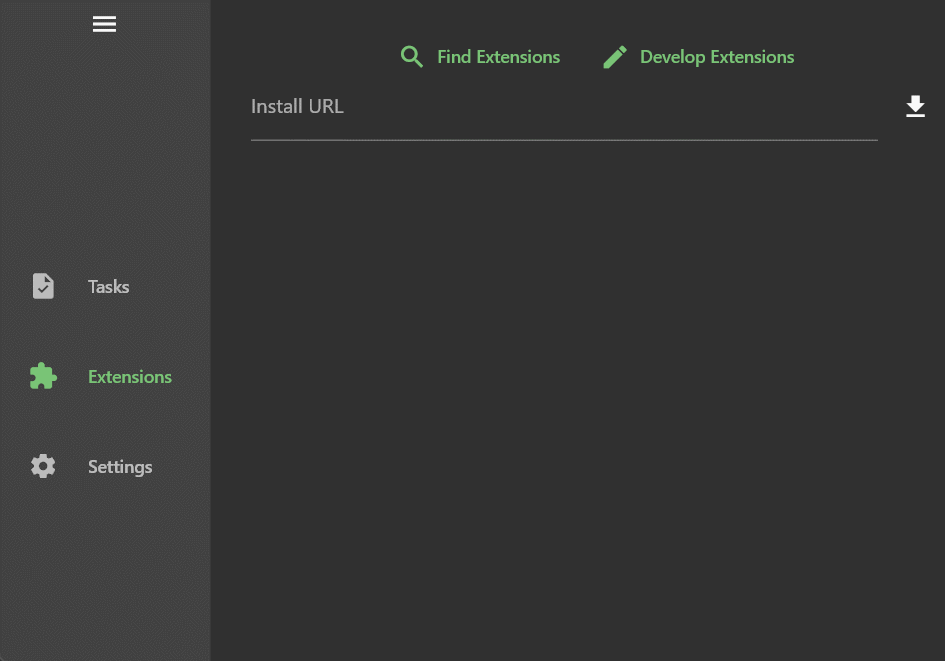
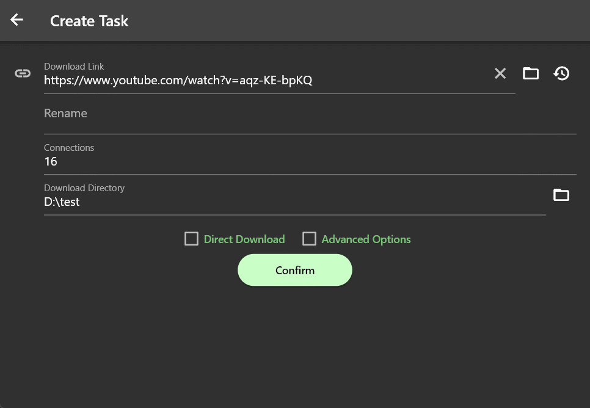

# Gopeed YouTube Extension

Download YouTube videos easily with [Gopeed](https://gopeed.com).

> Require Gopeed version >= 1.9.0

## Install

Open the `Gopeed` extension page, enter `https://github.com/monkeyWie/gopeed-extension-youtube`, and click install.



## Usage

Create task with youtube video url, and click `Download` button, then the video will be resolved and ready to download.



### Video Quality

Typically 1080p or better YouTube videos use separate video and audio streams. This extension downloads YouTube media in that separated form by default, so the video file you get is the video track only. If you want a single merged file, use `ffmpeg` to combine the downloaded audio and video.

The extension settings now include:

- `quality`: target video resolution, such as `1080p`, `1440p`, `2160p`, `best`, or `lowest`
- `qualityFallback`: when the requested resolution is not available, fall back to the highest available video quality

- ffmpeg command

```bash
ffmpeg -i video.webm -i audio.mp4 -c:v copy -c:a copy output.mp4
```

## Useful Links

- [YouTube.js](https://github.com/LuanRT/YouTube.js)
- [How to develop a gopeed extension](https://docs.gopeed.com/dev-extension.html)
